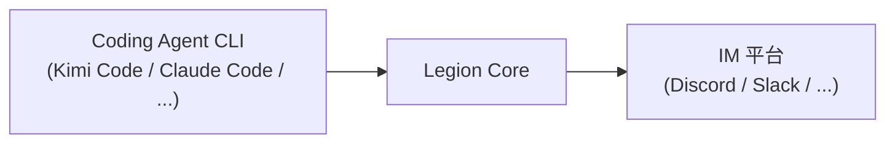

# Legion

Legion 是 coding agent 与 IM 平台之间的连接层。它让你在 Discord 等 IM 客户端里，与本地电脑上的多个 coding agent session、多个项目目录（workdir）进行交互——相当于把 terminal 里的 agent 体验搬到了聊天窗口。

## 核心映射

以 Discord 为例，Legion 把本地开发体验映射到 IM 的原生结构上：

| 本地开发 | Legion |
|---|---|
| 一个项目目录 | 一个 Discord Channel（即 main session） |
| 一个独立对话上下文 | 一个 Discord Thread（即 sub session） |
| 同一窗口的不同标签页共享同一个项目目录 | 同一 Channel 下的所有 Thread 共享同一个 workdir |
| agent 的输出与工具调用 | Channel / Thread 里的消息与卡片 |

## 整体架构



- **Agent 侧**：封装 coding agent CLI，把它们的私有输出转成统一事件。
- **Core**：维护 Session 与 workdir 绑定状态，处理命令与消息路由。
- **IM 侧**：对接具体 IM 平台，把事件渲染成消息。

Agent 层和 IM 层相互独立：接入新的 agent 或新的 IM 平台，都不需要改动 Core。当前 MVP 已接入 Kimi Code 与 Discord。

## 功能简介

- **远程使用 Kimi Code**：在 Discord Channel 或 Thread 里发消息，Legion 会在本地调用 `kimi` 并把结果发回 Discord。
- **Channel 是主 Session，Thread 是独立子 Session**：每个 Channel 绑定一个本地项目目录（workdir），该 Channel 下的所有 Thread 共享这个 workdir，但对话上下文相互隔离。
- **命令与 Slash Command**：同一套命令既支持文本消息，也支持 Discord 原生 Slash Command 补全。
- **状态持久化**：workdir 绑定、Session、默认 runner 等状态保存在 `~/.legion/state.json`，重启后自动恢复。

## 快速开始

### 前提

- Node.js >= 20
- npm
- 已安装并可运行的 [Kimi Code CLI](https://github.com/MoonshotAI/kimi-code)（命令行输入 `kimi` 可用）
- 一个 Discord Bot Token 和允许运行的 Server（Guild）ID

#### 获取 Discord Bot Token 与 Guild ID

1. 打开 [Discord Developer Portal](https://discord.com/developers/applications) 并登录。
2. 点击右上角 **New Application**，输入应用名称后创建。
3. 进入左侧 **Bot** 页面：
   - 点击 **Add Bot**（如果还没有 Bot）。
   - 在 **Privileged Gateway Intents** 里开启：
     - `GUILDS`
     - `GUILD_MESSAGES`
     - `MESSAGE_CONTENT`
   - 点击 **Reset Token**，复制生成的 Token（即 `LEGION_DISCORD_BOT_TOKEN`）。
4. 进入左侧 **OAuth2 > URL Generator**：
   - 在 **Scopes** 里勾选 `bot`。
   - 在 **Bot Permissions** 里勾选：`View Channels`、`Send Messages`、`Send Messages in Threads`、`Create Public Threads`、`Read Message History`、`Embed Links`、`Attach Files`。
   - 复制生成的 URL，在浏览器中打开，把 Bot 加入你的 Server。
5. 在 Discord 客户端里获取 Guild ID：
   - 进入 **用户设置 > 高级 > 开发者模式**，开启它。
   - 右键你的 Server 名称，选择 **复制服务器 ID**（即 `LEGION_DISCORD_ALLOWED_GUILD_ID`）。

### 1. 安装

```bash
git clone <仓库地址>
cd legion
npm install
```

### 2. 启动 Legion

```bash
npm run dev
```

首次启动会交互式询问 Discord bot token 和 allowed guild id，并写入 `~/.legion/config.json`。后续启动直接读取该文件，不再询问。

你也可以通过环境变量预填，跳过交互：

```bash
export LEGION_DISCORD_BOT_TOKEN="your-bot-token"
export LEGION_DISCORD_ALLOWED_GUILD_ID="your-guild-id"
npm run dev
```

### 3. 绑定工作目录

1. 把 Bot 加入对应的 Discord Server。
2. 在 Server 中创建一个 Text Channel。
3. 在 Channel 中发送：

   ```text
   /workdir /path/to/your/repo
   ```

   或输入 `/workdir` 查看当前已绑定的路径。

### 4. 开始对话

在 Channel 中直接发消息，例如：

```text
给这个项目补充一个 README
```

Legion 会调用本地 `kimi`，并把回复、思考、工具调用与结果发送回该 Channel。

### 5. 使用 Thread 隔离上下文

在 Channel 中创建 Thread，即可开启一个独立 Session。不同 Thread 之间互不影响，Thread 会与所在 Channel 共享同一个 workdir。

## 常用命令

| 命令 | 作用 |
|---|---|
| `/workdir <path>` | 绑定/查看当前 Channel 的 workdir |
| `/status` | 查看当前 workdir 与 Session 的状态 |
| `/agent [--global\|--workdir\|--session] [name]` | 查看或切换 runner，默认只影响当前 Session |
| `/help` | 显示可用命令说明 |

所有命令同时支持文本消息和 Discord Slash Command。

## Runner 模式

Legion 目前提供两个 Kimi Code runner，可通过 `/agent <name>` 切换：

| Runner | 特点 | 适用场景 |
|---|---|---|
| `kimi-code` | 调用 `--output-format stream-json`，能精确拿到 `tool_call` / `tool_result` 事件 | 需要清晰查看工具调用链路 |
| `kimi-code-text` | 调用 `--output-format text`，stdout 按字符/块流式输出 | 长文本回复，想要更流畅的流式体验 |

生效优先级：**Session > Workdir > Global**。未设置时依次向上继承。

## 配置示例

`~/.legion/config.json`：

```json
{
  "discord": {
    "botToken": "...",
    "allowedGuildId": "..."
  },
  "defaultAgent": "kimi-code"
}
```

状态默认持久化到 `~/.legion/state.json`，一般无需额外配置。

## 安全提示

- Legion 运行在**你自己可控的环境**中，所有 agent 操作等价于你本人执行，没有额外沙箱。
- 建议把 Bot 所在的 Channel 设为私有，仅允许可信用户访问。
- Bot Token、Guild ID 等敏感信息保存在 `~/.legion/config.json`，不会进入项目仓库。
- 通过 `/workdir` 绑定的目录会被 agent 读写，请谨慎绑定系统敏感路径。

## 开发

项目采用 TypeScript + npm workspaces，核心命令：

```bash
npm run dev        # 开发运行
npm run build      # 构建
npm run typecheck  # 类型检查
npm run lint       # 代码检查
npm run test       # 运行测试
npm run format     # 格式化
```

更详细的架构设计、接口说明、实现记录与调试方法请见 [`docs/`](docs/)。

## License

MIT
