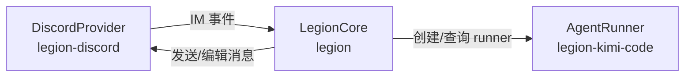

# Legion 设计与实现记录

本文档记录 Legion 当前的整体设计、Monorepo 结构、`IMProvider` 的 Slash Command 标准接口、关键决策与已知限制。它面向未来的维护者或想要理解这个项目的人。

## 1. 项目定位

Legion 是 **coding agent 与 IM 平台之间的桥接层**。

- 当前接入的 Agent：**Kimi Code CLI**。
- 当前接入的 IM 平台：**Discord**。
- 核心工作流：用户在 IM Channel / Thread 中发消息 → Legion 调用本地 Agent 处理 → 把思考、工具调用、结果、总结渲染回 IM 平台。

## 2. Monorepo 结构

项目使用 npm workspaces，拆分为三个包：

```
packages/
├── legion/              # 核心：配置、状态、Session/workdir、命令解析、IMProvider 抽象
├── legion-kimi-code/    # Agent runner：Kimi 的 stream-json / text 两种模式
└── legion-discord/      # IM provider：Discord 消息收发 + Slash Command 注册
```

- `legion` 作为可运行入口，依赖另外两个包。
- 每个包有自己的 `package.json`、`tsconfig.json` 与测试目录。
- 构建、类型检查、测试、格式化统一在根目录通过 aggregate scripts 运行。

## 3. 整体架构



关键模块：

- `packages/legion/src/im/`：IM 平台抽象 `IMProvider`、`IMMessage`、`IMCommandDefinition`。
- `packages/legion/src/core/`：消息路由、Session / workdir 管理、命令处理、命令定义。
- `packages/legion/src/agent/`：`AgentRunner` 接口与 `DefaultAgentRunnerFactory`。
- `packages/legion/src/config/`：配置加载、默认值、环境变量解析。
- `packages/legion/src/state/`：基于 JSON 文件的简单持久化。
- `packages/legion-kimi-code/src/`：Kimi Code CLI 的两个 runner 实现。
- `packages/legion-discord/src/`：Discord provider、Slash Command 构建与交互转换。

## 4. Slash Command 标准接口

Legion 把命令视为**文本消息命令**和**平台原生 Slash Command** 两种形态的同一事物。

核心导出：

```ts
// packages/legion/src/core/command-parser.ts
export const COMMAND_DEFINITIONS: IMCommandDefinition[];
```

每个 `IMProvider` 可以选择实现：

```ts
registerCommands?(commands: IMCommandDefinition[]): void | Promise<void>;
```

- 该接口是可选的；纯文本平台无需实现。
- `DiscordProvider` 在 `registerCommands` 中将定义转换为 Discord 原生 Slash Command，并在启动时通过 REST API 注册到指定 Guild。
- 当用户触发 Slash Command 时，`DiscordProvider` 会把它转换成等效的文本命令（例如 `/workdir /tmp/repo`），再交给 `LegionCore` 统一处理。
- Core 的第一条回复通过 `interaction.editReply` 发送，后续消息仍然走普通 channel send。

当前注册命令：

| 命令 | 作用 |
|---|---|
| `/workdir <path>` | 绑定/查看当前 workdir 的工作目录 |
| `/status` | 查看当前 workdir 状态 |
| `/agent [--global\|--workdir\|--session] [name]` | 查看或切换 runner（默认 session） |
| `/help` | 显示可用命令说明 |

## 5. 关键设计决策

### 5.1 Runner 直接注册，而不是通过配置文件反射

`packages/legion-kimi-code/src/index.ts` 显式注册：

```ts
runnerFactory.register('kimi-code', (cfg) => new KimiCodeRunner(cfg));
runnerFactory.register('kimi-code-text', (cfg) => new KimiCodeTextRunner(cfg));
```

这样新增 runner 需要改代码并注册，但好处是：

- runner 的**默认命令（`kimi`）**可以直接写在实现里，配置里不再需要 `binary`。
- runner 可以决定自己接受哪些参数、如何解析输出，core 只依赖统一的 `AgentRunner` 接口。

### 5.2 三级配置与继承

配置分为 **global / workdir / session** 三层：

- **global**：`~/.legion/config.json` 里的 `defaultAgent`，通过 `/agent --global <name>` 修改。
- **workdir**：每个 workdir（Discord Channel）独立保存的 `defaultAgent`，通过 `/agent --workdir <name>` 修改。
- **session**：当前消息上下文（Channel 或 Thread）的 `agent`，通过 `/agent --session <name>`（或省略 scope）修改。

生效优先级：**session > workdir > global**。新建 workdir 时默认继承 global；新建 Session/Thread 时默认继承所在 workdir 的设置。

```json
{
  "defaultAgent": "kimi-code"
}
```

- `defaultAgent` 是 global 默认值。
- `agents` 是可选的；key 就是 runner 名，仅在需要覆盖 runner 参数（如 `binary`、`env`）时才写。
- `binary` 是可选覆盖项，runner 内部已经默认使用 `kimi`。
- 保存配置时，如果 `agents` 为空或所有条目都是空对象，会自动从 `~/.legion/config.json` 中省略。

### 5.3 workdir 与 Session 模型

- **workdir**：对应一个 Discord Channel。记录 `path`、guildId、`defaultAgent`（可选；未设置时继承 global）。
- **Session**：对应一个消息上下文。Channel 消息用 main session；Thread 用 thread session，创建时按 **session > workdir > global** 解析 runner。
- 持久化：工作目录绑定、workdir 级 runner、session 状态都写到 `~/.legion/state.json`；global 级 runner 写到 `~/.legion/config.json`。

### 5.4 命令既支持文本也支持 Slash Command

同一套命令逻辑同时处理普通消息和 Discord Slash Command。Slash Command 的优势是有补全提示，降低用户学习成本。

### 5.5 Runner 输出在 Discord 的渲染

Discord 没有原生的可折叠区块（`<details>`）。最终采用**拆成多条消息**的方案：

1. tool_call：一条消息展示工具名和参数。
2. tool_result：一条消息展示原始返回。
3. 最终文本/总结：再发一条消息。

这样既能完整展示过程，又避免单条消息过长。

## 6. 两个 Kimi Runner

### 6.1 `kimi-code`

调用 `kimi -p <prompt> --output-format stream-json`。

根据 `kimi-code` 源码（`apps/kimi-code/src/cli/run-prompt.ts` 中的 `PromptJsonWriter`），`stream-json` 模式的输出规则如下：

- `assistant.delta` 事件会被累积到内部 `assistantText` 字符串中，直到 `flushAssistant()` 触发（例如遇到 `tool.result`、`hook.result`、`turn.step.started`、`turn.step.interrupted` 或 turn 结束）才一次性输出一整条 JSON line。
- `thinking.delta` 事件在 `PromptJsonWriter.writeThinkingDelta()` 中是**空实现**，因此 **thinking 完全不会出现在 `stream-json` 输出中**。
- `tool.call` / `tool.call.delta` 同样被累积到 `toolCalls` 数组中，随 assistant message 一起 flush；`tool.result` 会先把已累积的 assistant message flush 掉，再单独输出一条 `role: 'tool'` 的 JSON line。

因此：

- **优点**：能精确拿到 `tool_call` / `tool_result` 事件，结构化展示效果好。
- **缺点**：
  1. **thinking 完全不输出**；
  2. assistant text 不是 token 级流式，而是以单个 JSON 事件整段返回；
  3. tool call 也不是随调用立即出现，而是和 assistant text 一起累积到下一次 flush 才输出。

### 6.2 `kimi-code-text`

调用 `kimi -p <prompt> --output-format text`。

根据 `kimi-code` 源码（`apps/kimi-code/src/cli/run-prompt.ts` 中的 `PromptTranscriptWriter`），`text` 模式的输出规则如下：

- **stdout**：`PromptTranscriptWriter` 通过 `PromptBlockWriter` 写入 assistant 的最终回复，每个 block 开头带 `• `（`PROMPT_BLOCK_BULLET`），后续行缩进两个空格（`PROMPT_BLOCK_INDENT`）。`writeAssistantDelta` 会先结束当前的 thinking block，再写入 assistant block。
- **stderr**：`writeThinkingDelta` 通过另一个 `PromptBlockWriter`（绑定到 stderr）写入 thinking，因此同样以 `• ` 开头。
- **tool call / tool result / tool call delta 在 `text` 模式下全部是 no-op**（`writeToolCall`、`writeToolCallDelta`、`writeToolResult` 均为空实现）。
- 只有 `tool.progress` 事件会把原始 `update.text` 直接写 stderr，且**不带 bullet、不经过 `PromptBlockWriter`**。

因此 Legion 的解析规则是：

- stdout 去掉开头的 `• ` 后作为 `text`。
- stderr 中以 `• ` 开头的行作为 `thinking`。
- stderr 中不带 bullet 的行视为 `tool.progress` 的原始输出，近似为 `tool_result`。

- **优点**：stdout 按字符/块流式输出，长文本体验更好。
- **缺点**：
  1. `text` 模式本身不输出 tool 名称和参数，只能拿到工具执行过程中的 progress 文本；
  2. thinking 与最终文本都带 `• `，需要按 stdout/stderr 分流；
  3. stderr 中不带 bullet 的 progress 文本与 thinking 的区分依赖启发式规则，可能误判。

## 7. 踩过的坑

### 7.1 Discord 系统消息回复崩溃

Bot 尝试对系统消息（如加入服务器通知）发 reply 时，Discord 返回 `REPLIES_CANNOT_REPLY_TO_SYSTEM_MESSAGE`。

处理：

- `discord-provider.ts` 中跳过 `msg.system`。
- 发送失败时捕获该错误并降级为普通发送。

### 7.2 Thread 消息继承父 Channel workdir

Thread 消息的 `channelId` 是 thread 自己的 ID，不是父 Channel ID。为了让 Thread 能使用父 Channel 已绑定的 workdir：

- `discord-provider.ts` 在构造 `IMMessage` 时，把 thread 消息映射到父 Channel ID。
- core 里 session 的 `workdirId` 仍对应父 Channel。

### 7.3 Discord 没有可折叠区块

Discord 不支持 `<details>`/`<summary>`，原生 spoiler（`||...||`）只是“打码”，没有标题和边界感。因此 Legion 采用**三条独立消息**的展示方式（见 5.5）。

### 7.4 长文本流式输出感觉“卡住”

`kimi-code` 要等到模型生成完整 assistant 消息才返回一段文本，用户看不到逐字输出。

因此提供 `kimi-code-text` runner 作为可选模式；长文本场景可以切到该 runner。

### 7.5 Thread 创建只静默建立 Session

Thread 创建时不会发送任何欢迎或提示消息，只静默建立对应的 session。

### 7.6 npm `workspace:*` 协议不被 npm 11.7 支持

项目使用 `*` 作为 workspace 内部依赖版本，npm 会自动解析到本地包。

### 7.7 Discord 消息编辑 rate limit 限制流式粒度

Discord 对 Bot 的消息发送和编辑都有 rate limit（社区常见经验值为每个频道 5 秒 5 次，但官方未对编辑端点给出明确数值，具体限制通过响应头返回）。如果每次 stdout chunk 都触发一次消息编辑，很快就会收到 429，`discord.js` 会按 `Retry-After` 等待，反而让更新变得卡顿。

因此 `DiscordProvider` 对文本编辑做了防抖：

- 第一条文本立即发送/编辑（保证首响速度）。
- 后续更新在默认 `editDebounceMs: 1000ms` 窗口内合并，窗口结束时用最新完整文本编辑一次。
- 流结束时（`complete` 事件）flush 最后一次 pending 文本。

这意味着 Legion 无法做到逐字实时流式，只能以约每秒一次的频率批量更新。这是 Discord 平台本身的限制，不是 runner 或 core 的问题。如需调整体感，可在 `packages/legion/src/bootstrap.ts` 初始化 `DiscordProvider` 时传入 `editDebounceMs`，但调得过小容易触发 rate limit。

### 7.8 `kimi-code-text` 无法识别具体工具

根据 `kimi-code` 源码，`--output-format text` 模式下 `PromptTranscriptWriter.writeToolCall`、`writeToolCallDelta`、`writeToolResult` 都是空实现，只有 `tool.progress` 事件会把原始文本直接写 stderr。

因此 Legion 的 `kimi-code-text` runner 只能：

- 把带 `• ` 的 stderr 行识别为 thinking。
- 把不带 bullet 的 stderr 行识别为工具 progress 原始输出（近似 `tool_result`）。
- 把 stdout 识别为 assistant 最终回复。

但**无法知道当前是哪个 tool、参数是什么、正式的 tool_result 是什么**。想要精确的工具调用链路，必须使用 `kimi-code`。

## 8. 支持矩阵

### Agent / Runner

| Runner | 命令 | 流式输出 | Thinking | 工具调用 |
|---|---|---|---|---|
| `kimi-code` | `kimi -p <prompt> --output-format stream-json [--session <id>]` | ⚠️ 1. thinking 完全不输出；2. assistant text 不会逐 token 流式推送，而是生成完整一段后才一次性返回 | ❌ CLI 不暴露 | ✅ 精确事件 |
| `kimi-code-text` | `kimi -p <prompt> --output-format text [--session <id>]` | ⚠️ 1. stdout 按字符/块流式输出，但无法识别具体工具名/参数；2. stderr 中非 bullet 行是 `tool.progress` 原始文本，只能靠启发式规则与 thinking 区分，可能误判 | ⚠️ 有局限：thinking 以 `• ` 引导的 stderr 缩进块输出，runner 可完整捕获 | ❌ 无法识别：`text` 模式下 `writeToolCall` / `writeToolCallDelta` / `writeToolResult` 均为空实现，不输出 tool 名称/参数，只能拿到 progress 原始文本 |

### IM 平台

| 平台 | Slash Command | 可折叠块 | 实时流式 |
|---|---|---|---|
| Discord | ✅ | ❌ 平台不支持：Discord 消息不支持 `<details>`/`<summary>`，所以 Legion 把工具调用/结果拆分为多条消息以完整显示 | ⚠️ 受 rate limit 限制：Bot 消息编辑默认 1000ms 防抖批量更新，无法做到逐字实时 |

## 9. 环境变量

首次运行没有配置文件时会交互式询问。也可以通过环境变量预填：

```bash
export LEGION_DISCORD_BOT_TOKEN="your-bot-token"
export LEGION_DISCORD_ALLOWED_GUILD_ID="your-guild-id"
export LEGION_KIMI_RUNNER="kimi-code"   # 默认 runner 名称
export LEGION_KIMI_BINARY="kimi"               # 可选：覆盖 kimi 路径
```

## 10. 端到端调试

Bot 只能以 Bot 身份发消息，无法模拟真实用户。因此完整的 Discord 消息流测试需要人工配合：

1. 启动 Legion：

   ```bash
   npm run dev
   ```

2. 在 Discord 客户端中以普通用户身份进入测试 Channel：
   - 发送 `/workdir /path/to/project` 绑定工作目录
   - 发送普通消息触发 Kimi Code
   - 新建 Thread 测试 Session 隔离
   - 尝试 `/agent` 与 `/help` 的 Slash Command 补全

3. 观察终端日志确认消息被接收、Kimi 被调用、回复已发送到 Discord。

## 11. 开发命令

```bash
# 安装依赖
npm install

# 开发运行
npm run dev

# 类型检查
npm run typecheck

# 代码检查与格式化
npm run lint
npm run lint:fix
npm run format
npm run format:check

# 测试
npm run test
npm run test:watch

# 构建
npm run build
```

提交前请确保 `npm run lint && npm run typecheck && npm run test && npm run format:check` 全部通过（husky + lint-staged 会在 `git commit` 时自动校验）。

## 12. 开发检查

提交/发布前应运行：

```bash
npm run typecheck && npm run lint && npm run test && npm run format:check
```

## 13. 配置文件示例

`~/.legion/config.json`：

```json
{
  "discord": {
    "botToken": "...",
    "allowedGuildId": "..."
  },
  "defaultAgent": "kimi-code",
  "stateStore": {
    "path": "~/.legion/state.json"
  }
}
```

## 14. 后续变更

- 2026-06-16：`kimi-code-text` runner 已被移除。`--output-format text` 模式在工具识别、thinking 与 progress 区分等方面存在根本局限，当前由 `kimi-code`（`--output-format stream-json`）与 `claude-code` 覆盖，不再维护。

---

创建日期：2026-06-14
最后更新：2026-06-16
