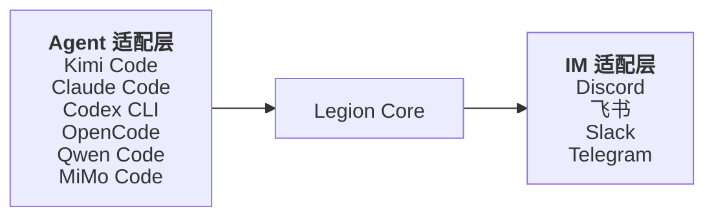
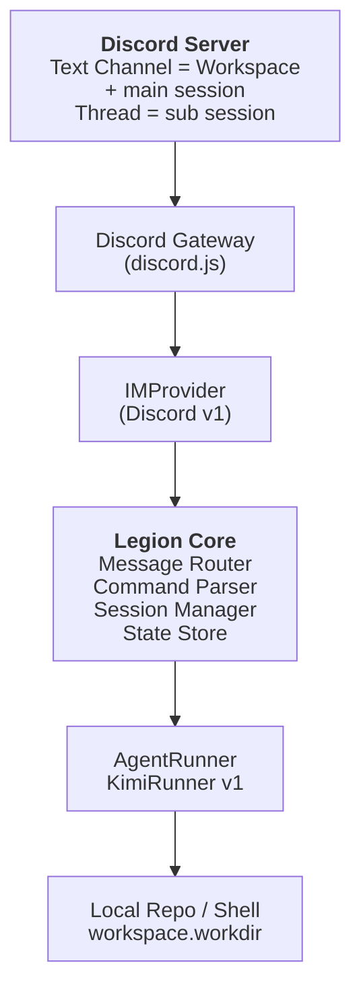
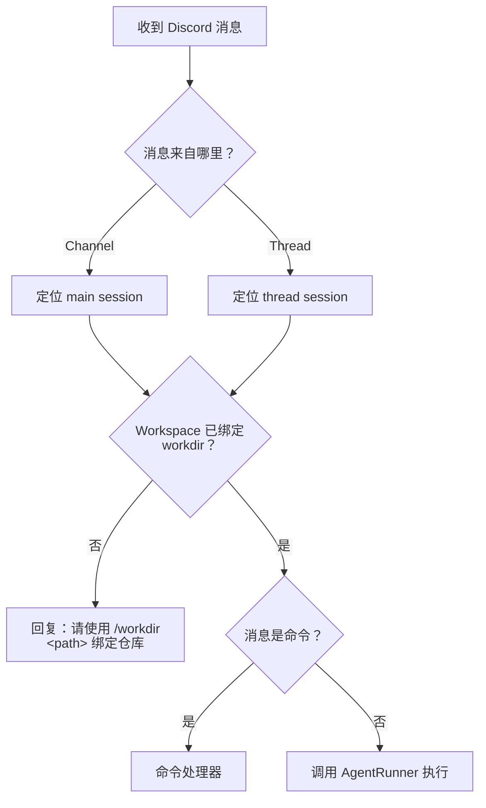

# Legion 设计稿

## 1. 引言：动机与问题

Coding agent CLI（如 Kimi Code、Claude Code、Codex CLI、OpenCode、Qwen Code、MiMo Code）正在成为个人开发的重要工具。它们直接在终端里理解代码库、调用工具、修改文件，相当于一个"会写代码的搭档"。

但这些工具有一个共同限制：**它们被设计成本地终端交互**。当你不在电脑前，或者想用手机/平板远程驱动它们时，体验很差：

- 没有原生的移动端界面。
- 多 session 管理依赖终端 history 或各自私有的 session 文件。
- 无法方便地让朋友/协作者通过一个熟悉的聊天界面与你共享同一个 agent 会话。

Legion 的目标就是解决这个问题：**把 coding agent CLI 的能力桥接到 IM 平台**，让你在任何能发消息的地方，像坐在电脑前一样远程使用 agent。

## 2. 宏观设计理念

### 2.1 Legion 是什么

Legion 是 **coding agent CLI 与 IM 平台之间的桥接层**。它不实现 LLM，也不实现 IM 客户端，只做三件事：

1. **接入各种 coding agent CLI**，把它们千差万别的输出格式统一成一种内部事件流。
2. **接入各种 IM 平台**，把内部事件流渲染成该平台的消息、卡片、Thread。
3. **维护 Workspace / Session 两层状态**，让用户在 IM 里自然地管理多个项目、多个独立会话。



### 2.2 核心隐喻：模拟"一个人正在用自己的电脑"

Legion 不把远程使用当作一个"聊天机器人"来设计，而是把它当作**本地开发体验在 IM 上的映射**。三个核心概念对应三种日常开发动作：

| 本地开发动作 | Legion 抽象 | 说明 |
|---|---|---|
| 打开一个 VSCode 窗口并绑定到某个 repo | **Workspace** | 一个 IM 群/Channel 对应一个项目目录 |
| 在窗口里开多个标签页/聊天线程 | **Session** | 每个 Thread 是一个独立对话上下文 |
| 看 terminal 里 agent 逐段输出文本、调用工具 | **AgentEvent** | 统一的 agent 输出事件流 |

这种隐喻的好处是：用户不需要学习 Legion 独有的概念。Discord Channel 就是 Workspace，Thread 就是 Session，agent 的回复就是消息。

### 2.3 三个正交抽象

为了让"任意 agent × 任意 IM"的组合可行，Legion 提取了三套正交抽象：

- **AgentRunner**：描述一个 coding agent CLI 如何被调用、如何被中断、如何输出事件。
- **IMProvider**：描述一个 IM 平台如何接收输入、如何发送/编辑消息、如何渲染 AgentEvent。
- **Legion Core**：连接 Runner 与 Provider，维护 Workspace / Session 状态，处理路由与命令。

新增一种 agent，只需实现 `AgentRunner`；新增一种 IM，只需实现 `IMProvider`。两者互不影响。

### 2.4 为什么选 Discord 作为第一 IM

Discord 的 **Channel + Thread** 模型与 Workspace + Session 的抽象天然契合：

- **Text Channel** 既是一个 Workspace，也是该 Workspace 的默认主 Session。
- **Thread** 是从主 Session 分叉出来的独立子 Session，可灵活创建、归档、删除。
- 用户通过 Discord 原生的"创建 Thread"交互即可获得多 session 能力，无需记忆命令。

本设计稿以 Discord 为第一目标平台，同时保留 `IMProvider` 抽象，未来可接入飞书、Slack 等。

## 3. 核心概念

### 3.1 Workspace

Workspace 对应一个项目目录。每个 Discord Text Channel 绑定一个本地 `workdir`。

```ts
interface Workspace {
  id: string;           // Discord Channel ID
  name: string;         // Channel 名称，如 "repo-a"
  workdir: string;      // 本地绝对路径
  defaultAgent: string; // 默认 agent，如 "kimi"
  guildId: string;      // 所属 Discord Server ID
  createdAt: string;
}
```

- 创建方式：在 Discord 里创建一个 Text Channel，然后在 Channel 里发 `/workdir /path/to/repo` 绑定。
- 不同 Channel 之间完全隔离（不同 workdir）。
- 同 Channel 内所有 Thread 共享同一个 workdir，但会话上下文隔离。
- Channel 名**不**自动作为 workdir 别名：一律通过 `/workdir <path>` 显式绑定。
- MVP 阶段只支持一个 Discord Server。
- Channel 名**不**自动作为 workdir 别名：一律通过 `/workdir <path>` 显式绑定。
- MVP 阶段只支持一个 Discord Server。

### 3.2 Session

Session 对应一个独立的对话上下文。Legion Session.id 直接复用 Discord 的 Channel/Thread ID。

```ts
interface Session {
  id: string;              // Discord Channel ID（main）或 Thread ID（thread）
  name: string;            // Channel/Thread 名称
  workspaceId: string;     // 父 Workspace ID
  type: "main" | "thread"; // main = Channel 本身；thread = Thread
  agent: string;           // agent 类型
  agentSessionId?: string; // 底层 agent CLI 的 session id
  status: "idle" | "running" | "error";
  createdAt: string;
  lastUsedAt: string;
}
```

- **main session**：Channel 本身的聊天记录。
- **thread session**：Thread 内的聊天记录。
- `agentSessionId` 是 Kimi Code / Claude Code / Codex CLI 等底层工具自己生成的 session id；Legion 在首次运行时捕获并持久化，后续用于恢复上下文。

### 3.3 AgentEvent：统一事件流

不同 coding agent CLI 的私有输出格式差异很大：

- Kimi Code：`role=assistant/tool/meta`
- Claude Code：`type=system/assistant/user/result/progress`
- Codex CLI：`type=thread.started/turn.completed/item.completed/error`
- OpenCode / MiMo Code：`type=step_start/text/tool_use/step_finish/...`
- Qwen Code：`type=text/tool_call/tool_result/...`

Legion 把它们全部翻译成统一的 `AgentEvent`：

```ts
type AgentEvent =
  | TextEvent
  | ToolCallEvent
  | ToolCallDeltaEvent
  | ToolResultEvent
  | ThinkingEvent
  | SessionInitEvent
  | UsageEvent
  | ErrorEvent
  | CompleteEvent;

interface TextEvent {
  type: 'text';
  text: string;    // 当前累积的完整文本
  delta?: string;  // 可选增量，用于字符级流式
}

interface ToolCallEvent {
  type: 'tool_call';
  toolId: string;
  toolName: string;
  input: unknown;  // 已解析的完整工具参数
}

interface ToolCallDeltaEvent {
  type: 'tool_call_delta';
  toolId: string;
  toolName: string;
  partialInput: string; // 当前累积的 JSON 字符串（尚未保证可解析）
  delta: string;        // 本次增量 JSON 片段
}

interface ToolResultEvent {
  type: 'tool_result';
  toolId: string;
  output: string;
}

interface ThinkingEvent {
  type: 'thinking';
  text: string;    // 当前累积的完整 thinking
  delta?: string;  // 可选增量，用于字符级流式
}

interface SessionInitEvent {
  type: 'session_init';
  agentSessionId: string;
}

interface UsageEvent {
  type: 'usage';
  inputTokens?: number;
  outputTokens?: number;
  cacheReadTokens?: number;
  cacheCreationTokens?: number;
  costUsd?: number;
}

interface ErrorEvent {
  type: 'error';
  message: string;
  fatal: boolean;
}

interface CompleteEvent {
  type: 'complete';
  exitCode: number;
}
```

**处理约定**：

- `AgentEvent` 是 AgentRunner 与 IMProvider 之间的中间格式，Runner 只负责翻译，不参与平台渲染。
- `session_init` 必须被 Legion Core 捕获并持久化到 `Session.agentSessionId`。
- `error.fatal === true` 时，IMProvider 需要在最终回复中明确报错。
- `complete` 表示子进程结束，Core 用于清理，IMProvider 用于最终收尾。
- `delta` 字段是可选的：支持真流式的 runner（如 `claude-code`）可以输出增量；不支持的 runner（如 `kimi-code`）可以只输出完整 `text`/`thinking`，IMProvider 应同时兼容两种形式。
- `tool_call_delta` 是可选的中间态：支持工具参数 JSON 流式累积的 runner 可以输出，IMProvider 可选择渲染实时拼装过程，或仅等待最终的 `tool_call`。

## 4. 系统架构

### 4.1 组件交互与数据流



| 层级 | 职责 | 主要接口/类 |
|---|---|---|
| **Agent 适配层** | 封装 coding agent CLI，把私有输出翻译成统一 `AgentEvent` | `AgentRunner`、`AgentRunnerFactory`、`AgentConfig`、`SessionContext` |
| **Legion Core** | 会话管理、消息路由、命令解析、状态持久化 | `LegionCore`、`WorkspaceManager`、`SessionManager`、`MessageRouter`、`CommandParser`、`StateStore` |
| **IM 适配层** | 对接具体 IM 平台，把 `AgentEvent` 渲染成平台消息 | `IMProvider`、`IMTarget`、`IMMessageRef`、`IMMessage`、`IMThread`、`RenderState` |

### 4.2 依赖方向

依赖只允许从外向内：

```
IMProvider → LegionCore → AgentRunner
```

- Core 不依赖任何具体的 `AgentRunner` 实现。
- Core 不依赖任何具体的 `IMProvider` 实现。
- `AgentRunner` 与 `IMProvider` 之间不直接通信，全部通过 Core 协调。

这种设计保证新增 agent 不需要调整 Core 和 IMProvider，新增 IM 平台也不需要调整 Core 和 AgentRunner。

### 4.3 Core 组件

```ts
class LegionCore {
  constructor(config: CoreConfig);
  start(): Promise<void>;
  handleMessage(msg: IMMessage): Promise<void>;
}

interface WorkspaceManager {
  get(id: string): Workspace | undefined;
  bind(workspaceId: string, workdir: string): Promise<Workspace>;
}

interface SessionManager {
  get(id: string): Session | undefined;
  createFromThread(thread: IMThread): Session;
  setAgentSessionId(sessionId: string, agentSessionId: string): void;
}

interface MessageRouter {
  route(msg: IMMessage): Promise<RouteResult>;
}

interface CommandParser {
  parse(content: string): Command | null;
}

interface StateStore {
  load(): Promise<LegionState>;
  save(state: LegionState): Promise<void>;
}

interface CoreConfig {
  imProvider: IMProvider;
  runnerFactory: AgentRunnerFactory;
  stateStore: StateStore;
  allowedUserIds?: string[];
  allowedGuildIds?: string[];
}

interface LegionState {
  workspaces: Record<string, Workspace>;
  sessions: Record<string, Session>;
}

type Command =
  | { type: 'workdir'; path?: string }
  | { type: 'agent'; name: string }
  | { type: 'thread'; action: 'new' | 'list' | 'archive' | 'delete'; name?: string }
  | { type: 'unknown' };

interface RouteResult {
  type: 'command' | 'prompt';
  session: Session;
  command?: Command;
  prompt?: string;
}
```

### 4.4 命名约定

- `*Runner`：可执行、可中断的子进程封装（`AgentRunner`、`KimiRunner`）。
- `*Provider`：对外部平台或服务的适配（`IMProvider`、`DiscordProvider`）。
- `*Manager`：领域对象生命周期管理（`SessionManager`、`WorkspaceManager`）。
- `*Router` / `*Parser` / `*Store`：按职责命名（`MessageRouter`、`CommandParser`、`StateStore`）。
- `*Event`：统一事件流中的事件类型（`AgentEvent`、`TextEvent`）。
- `*Ref`：平台相关的引用，用于后续编辑（`IMMessageRef`）。

## 5. 数据模型与持久化

Legion 状态持久化到 `~/.legion/state.json`：

```json
{
  "workspaces": {
    "1234567890123456789": {
      "id": "1234567890123456789",
      "name": "repo-a",
      "workdir": "/home/dinghao/projects/repo-a",
      "defaultAgent": "kimi",
      "guildId": "9876543210987654321",
      "createdAt": "2026-06-14T12:00:00Z"
    }
  },
  "sessions": {
    "1234567890123456789": {
      "id": "1234567890123456789",
      "name": "repo-a",
      "workspaceId": "1234567890123456789",
      "type": "main",
      "agent": "kimi",
      "status": "idle",
      "createdAt": "2026-06-14T12:00:00Z",
      "lastUsedAt": "2026-06-14T12:00:00Z"
    },
    "1111111111111111111": {
      "id": "1111111111111111111",
      "name": "fix-login",
      "workspaceId": "1234567890123456789",
      "type": "thread",
      "agent": "kimi",
      "agentSessionId": "01912345-6789-7abc-8def-0123456789ab",
      "status": "idle",
      "createdAt": "2026-06-14T12:30:00Z",
      "lastUsedAt": "2026-06-14T12:30:00Z"
    }
  }
}
```

## 6. 技术选型

Legion 采用 **TypeScript / Node.js** 实现。

| 考量 | 说明 |
|---|---|
| Discord 生态 | `discord.js` 是 Node 生态事实标准。 |
| 子进程调用 | Node 的 `child_process.spawn` 非常适合流式消费 JSONL/NDJSON。 |
| 异步事件驱动 | 与 `AgentEvent` 流、IM 事件、debounce 编辑天然契合。 |
| IM SDK 丰富 | 飞书、Slack、Telegram 都有成熟的 Node SDK。 |
| 类型安全 | TypeScript 能精确表达 `AgentRunner`、`IMProvider`、`AgentEvent` 等接口。 |
| 环境一致 | 当前环境已有 Node.js `v24.13.0` / npm `v11.7.0`。 |
| Agent 技术栈一致 | Kimi Code CLI 本身基于 Node/TypeScript，便于参考其 `stream-json` 解析。 |

**关键依赖**：`discord.js`、Node 内置模块。MVP 阶段以轻量依赖为主。

### 6.1 配置管理

Legion 需要持久化一部分配置（如 Discord bot token、allowed guild id、agent 二进制路径等）。配置来源支持环境变量和交互式输入，初始化完成后统一写入本地配置文件，后续直接从本地读取。

#### 6.1.1 配置文件

默认路径：`~/.legion/config.json`（与 `~/.legion/state.json` 同级，位于用户家目录，避免 token 随项目仓库泄露）。

```json
{
  "discord": {
    "botToken": "...",
    "allowedGuildId": "..."
  },
  "agents": {
    "kimi": {
      "binary": "kimi",
      "timeoutSeconds": 300
    }
  },
  "stateStore": {
    "path": "~/.legion/state.json"
  }
}
```

#### 6.1.2 初始化流程

1. 启动时读取 `~/.legion/config.json`。
2. 若文件不存在或必填字段缺失，依次从环境变量读取（如 `LEGION_DISCORD_BOT_TOKEN`、`LEGION_DISCORD_ALLOWED_GUILD_ID`）。
3. 环境变量仍缺失时，通过命令行交互式询问用户。
4. 收集完整配置后写入 `~/.legion/config.json`。
5. 后续启动直接读取本地配置文件，不再询问。

#### 6.1.3 配置优先级

本地配置文件创建后即为唯一来源。如需更新，可手动编辑 `~/.legion/config.json` 或删除它重新初始化。

## 7. Agent 适配层

### 7.1 AgentRunner 接口

```ts
interface AgentRunner {
  readonly name: string;
  run(ctx: SessionContext, prompt: string): AsyncIterable<AgentEvent>;
  interrupt(): Promise<void>;
  kill(): Promise<void>;
}

interface SessionContext {
  sessionId: string;        // Legion Session.id
  workdir: string;          // Workspace 绝对路径
  agentSessionId?: string;  // 底层 agent CLI 的 session id；首次调用时为空
  model?: string;           // 用户指定的模型
  threadName?: string;      // Thread/Session 名称
}
```

**设计要点**：

- Runner 无状态：只保存配置，不保存会话状态。
- 单次调用 = 一个子进程：每次 Discord 消息对应一次 CLI 调用，调用结束后进程退出。
- 统一 session id 管理：所有 agent CLI 在首次调用时自动生成 session id，Legion 通过 `session_init` 事件捕获并持久化。

### 7.2 AgentRunnerFactory

```ts
interface AgentRunnerFactory {
  create(name: string, config: AgentConfig): AgentRunner;
  list(): string[];
}

interface AgentConfig {
  binary?: string;
  model?: string;
  timeoutSeconds?: number;
  env?: Record<string, string>;
  [key: string]: unknown;
}
```

注册示例：

```ts
factory.register('kimi', (config) => new KimiRunner(config));
factory.register('claude', (config) => new ClaudeCodeRunner(config));
factory.register('codex', (config) => new CodexCLIRunner(config));
factory.register('opencode', (config) => new OpenCodeRunner(config));
factory.register('qwen', (config) => new QwenCodeRunner(config));
factory.register('mimo', (config) => new MiMoCodeRunner(config));
```

### 7.3 支持的 Coding Agent 对照

| Coding Agent | 创建 Session | 恢复 Session | 关键输出格式 | `agentSessionId` 来源 |
|---|---|---|---|---|
| **Kimi Code** | `kimi -p "..." --output-format stream-json` | `kimi --session <id> -p "..." --output-format stream-json` | JSONL：`role=assistant/tool/meta` | `meta.session.resume_hint.session_id` |
| **Claude Code** | `claude -p "..." --output-format stream-json --verbose --permission-mode bypassPermissions` | `claude -p "..." --resume <id> --output-format stream-json --verbose --permission-mode bypassPermissions` | JSONL：`type=system/assistant/user/result` | `system.subtype=init.session_id` |
| **Codex CLI** | `codex exec --json "..."` | `codex exec resume --json <id> "..."` | JSONL：`type=thread.started/turn.completed/item.completed/error` | `thread.started.thread_id` |
| **OpenCode** | `opencode run --format json "..."` | `opencode run --session ses_xxx --format json "..."` | JSONL：`type=step_start/text/tool_use/step_finish/...` | `step_start.sessionID` |
| **Qwen Code** | `qwen --prompt "..." --output-format stream-json` | `qwen --prompt "..." --resume <id> --output-format stream-json` | JSONL：`type=text/tool_call/tool_result/...` | `step_start` / `init` 中的 session id |
| **MiMo Code** | `mimo run --format json "..."` | `mimo run --session <id> --format json "..."` | JSONL：`type=step_start/text/tool_use/step_finish/...` | `step_start.sessionID` |

**关于 GLM / MiniMax**：智谱 GLM 与 MiniMax 目前都没有官方独立维护的 coding agent CLI，因此第一阶段不把它们作为独立 Runner 实现。未来如果官方推出原生 CLI，再按同样接口接入。

**无人值守约定**：Legion 默认以各 runner 能达到的最高自动权限运行。Kimi Code 的 `-p` 模式本身即自动执行工具；Claude Code 则通过 `--permission-mode bypassPermissions` 实现完全无人值守。具体 Runner 实现不应把权限选择暴露给用户，除非未来明确需要交互式确认模式。

### 7.4 Kimi Code 调用示例

每个 prompt 执行：

```bash
cd <workspace.workdir>
kimi --session <agentSessionId> -p "<prompt>" --output-format stream-json
```

首次创建流程：

1. 用户在 Thread 中发送第一条非命令消息。
2. Legion 发现该 `Session.id` 没有对应的 `agentSessionId`。
3. 第一次调用不带 `--session`：
   ```bash
   cd <workspace.workdir> && kimi -p "<prompt>" --output-format stream-json
   ```
4. 解析 `session.resume_hint`，提取 `session_id`，写入 `Session.agentSessionId`。
5. 后续同一 Thread 的消息均带 `--session <agentSessionId>` 执行。

并发模型：

- 每个 Session 一次只处理一个 prompt（同 Thread 内串行）。
- 同一 Session 收到多条消息时，按到达顺序**排队**，等当前 prompt 完成后再发送下一条。
- 不同 Thread 之间可并发（独立 Kimi Code 进程）。
- Channel 的 main session 与 Thread session 可并发。

## 8. IM 适配层

### 8.1 IMProvider 接口

```ts
interface IMProvider {
  name: string;
  start(): Promise<void>;

  // 平台原语
  sendText(target: IMTarget, text: string): Promise<IMMessageRef>;
  editText(ref: IMMessageRef, text: string): Promise<void>;
  sendEmbed(target: IMTarget, embed: IMEmbed): Promise<IMMessageRef>;
  editEmbed(ref: IMMessageRef, embed: IMEmbed): Promise<void>;
  sendTyping(target: IMTarget): Promise<void>;

  // AgentEvent 渲染
  renderEvent(
    target: IMTarget,
    event: AgentEvent,
    state: RenderState
  ): Promise<RenderState>;

  // 事件监听
  onMessage(handler: (msg: IMMessage) => void): void;
  onThreadCreate(handler: (thread: IMThread) => void): void;
  onThreadDelete(handler: (threadId: string) => void): void;
  onThreadArchive(handler: (threadId: string, archived: boolean) => void): void;
}

interface RenderState {
  replyMessageRef?: IMMessageRef;
  toolEmbedRefs: Map<string, IMMessageRef>;
  thinkingMessageRef?: IMMessageRef;
  statusPrefix?: string;
}
```

### 8.2 为什么把渲染放在 IM 层

- **AgentRunner 完全平台无关**：它只关心如何把私有 JSONL 翻译成 `AgentEvent`。
- **不同平台渲染策略不同**：Discord 有 Embed、2000 字符限制、5 秒 5 次编辑限制；飞书/Slack 有自己的消息卡片。把这些差异收敛在 `IMProvider.renderEvent` 里，Core 可以复用同一套事件消费逻辑。
- **未来接入新平台**时，只需要实现新的 `IMProvider`。

### 8.3 流式回复与工具渲染

Legion 的"流式"是**事件驱动编辑**：`IMProvider.renderEvent()` 每收到一个 `AgentEvent`，就更新对应 Channel/Thread 的平台消息。

| Agent / Runner | 事件粒度 | 流式体验 |
|---|---|---|
| `kimi-code`（`--output-format stream-json`） | 完整 assistant block | 块级更新；thinking 不输出；assistant text 以单个 JSON 事件整段返回，无 token 级流式 |
| `kimi-code-text`（`--output-format text`） | stdout 字符/块 | stdout 按字符/块流式；但无法识别具体工具名/参数，stderr 中非 bullet 的 progress 文本需靠启发式与 thinking 区分 |
| Claude Code | 完整 block + 可选 partial | 默认块级；可字符级 |
| Codex CLI | `item.completed` 完整块 | 块级更新 |
| OpenCode | `text` 完整块 | 块级更新 |
| Qwen Code | `stream-json` 事件 | 块级或句子级 |
| MiMo Code | `step` 完整块 | 块级更新 |

**工具调用渲染**：

- 收到 `tool_call` 时发送黄色 Embed，显示运行中。
- 收到 `tool_result` 后更新为完成态，结果默认折叠。
- 工具分类图标：Read 🔍、Edit ✏️、Command 🔧、Web 🌐、Thinking 💭。

## 9. Legion Core 工作流

### 9.1 消息路由



**响应策略**：Bot 对 Channel/Thread 内的**每条消息**都进行路由和响应，不需要 `@Bot`。

### 9.2 Thread 生命周期

| Discord 事件 | Legion 行为 |
|---|---|
| `channelCreate` | 自动发送 Workspace 引导消息 |
| `threadCreate` | 自动创建 thread session，并发送 Session 引导消息 |
| `threadDelete` | 可选清理 Legion 自身的 session 记录；底层 agent session 文件不删除 |
| `threadUpdate`（archived） | 标记 session 为 archived；底层 agent session 记录保留 |
| `threadUpdate`（unarchived） | 恢复 session 为 active |

### 9.3 命令设计

**Workspace 命令**（在 Channel 中使用）：

| 命令 | 说明 |
|---|---|
| `/workdir <path>` | 绑定当前 Channel 到 workdir |
| `/workdir` | 查看当前 workdir |
| `/status` | 查看 Workspace 信息 |
| `/agent <name>` | 切换默认 agent（未来） |

**Session 管理命令**：

| 命令 | 说明 |
|---|---|
| `/thread new <name>` | 创建 Thread/Session |
| `/thread list` | 列出 Thread Session |
| `/thread archive <name>` | 归档 Thread |
| `/thread delete <name>` | 删除 Thread |

### 9.4 自动引导消息

为降低首次使用成本，Bot 在新 Workspace / Session 创建时自动发送一条固定文案的引导消息。MVP 阶段文案写死，后续可配置。

**Channel 创建时（Workspace 引导）：**

```text
欢迎来到新的 Workspace！
- 绑定项目目录：/workdir <path>
- 在当前频道直接发消息，即与主 Session 对话
- 需要独立上下文时，右键消息 → 创建 Thread
```

**Thread 创建时（Session 引导）：**

```text
新的 Session 已创建，继承当前 Channel 的 workdir。
直接发消息即可开始与 agent 对话。
```

## 10. Discord Bot 配置

### 10.1 Gateway Intents

- `GUILDS`：接收 guild/channel/thread 事件
- `GUILD_MESSAGES`：接收频道消息
- `MESSAGE_CONTENT`：读取消息内容（Privileged，必需）
- `GUILD_MEMBERS`：可选，用于白名单

### 10.2 Bot 权限

- View Channels
- Send Messages
- Send Messages in Threads
- Create Public Threads
- Manage Threads（可选）
- Read Message History
- Embed Links
- Attach Files

## 11. 安全设计

- Bot 只在用户拥有的 Discord Server 中运行。
- 建议将 Bot 加入的 Channel 设为私有。
- 所有 Agent 操作以运行 Legion 的 OS 用户身份执行，等价于本人操作。
- 可选白名单：

```ts
interface Config {
  allowedUserIds?: string[];
  allowedGuildIds?: string[];
}
```

## 12. 扩展性

### 12.1 多 Agent 支持

未来接入其他 coding agent 只需：

1. 实现 `AgentRunner` 接口。
2. 注册到 `AgentRunnerFactory`。
3. 配置 Workspace/Session 默认 agent。

第一阶段不实现多 agent 切换，但 Core 保留 `Session.agent` 字段和工厂注册点。

### 12.2 多 IM 支持

未来接入其他 IM 只需实现 `IMProvider`。AgentRunner 不需要任何调整。

### 12.3 Forum Channel 支持

Discord Forum Channel 每个 post 就是一个 Thread，未来可专门支持：一个 Forum Channel = 一个 Workspace，每个 post = 一个 Session。

## 13. 第一阶段 MVP 范围

**必须实现**：

1. Discord Bot 连接，接收 Channel 和 Thread 消息。
2. `/workdir <path>` 绑定 Workspace。
3. Channel 普通消息路由到 main session。
4. Thread 消息路由到 thread session。
5. 调用 Kimi Code CLI 执行 prompt。
6. 结果回复到对应 Channel/Thread。
7. state 持久化到 JSON。
8. 事件驱动编辑的轻量流式回复（块级更新 + debounce）。
9. 工具调用 Embed 渲染（分类图标 + 折叠结果）。

**不实现**：

- 多 agent 切换。
- 默认字符级流式（`kimi-code` runner 为块级更新；`kimi-code-text` runner 作为可选模式提供 stdout 字符/块流式，但有工具识别和 thinking 区分方面的局限）。
- Forum Channel 支持。
- 白名单（可后续加）。
- Web UI。
- Emoji reaction 状态指示。

## 14. 风险与待确认问题

### 14.1 关键假设与风险

**假设**：

- Legion 运行在用户本人可控的环境中，所有 agent 操作等价于该 OS 用户本人操作。
- 底层 coding agent CLI（Kimi Code 等）已在外部正确安装、登录并配置好默认模型。
- Discord Bot token、Gateway Intents、Channel/Thread 权限由用户在 Developer Portal 自行配置正确。
- 本地 `~/.legion/state.json` 存储在用户家目录，未做加密；泄露只暴露 channel/thread 与 workdir 的映射，不暴露代码内容。

**风险**：

- Bot token 或 guild/channel 权限配置不当，可能导致未授权访问。
- 用户通过 `/workdir` 绑定的路径没有沙箱，agent 可以读写该路径下任何文件。
- Discord Gateway 或 API 不可用将直接影响服务可用性。
- 外部 agent CLI 的输出格式或 session 机制变更，可能需要同步调整 `KimiRunner`。

### 14.2 待确认问题

1. `/thread new / archive / delete` 命令是否保留，还是完全依赖 Discord 原生 Thread 交互？
2. 用户如何中断运行中的 agent？是否需要 `/stop` 或 `/cancel` 命令，具体对应什么信号（SIGINT / SIGTERM）？
3. `/workdir <path>` 中的路径需要哪些校验？是否必须存在、是否允许相对路径、是否允许绑定系统敏感目录？

## 15. 参考来源

- [MoonshotAI/kimi-code](https://github.com/MoonshotAI/kimi-code) — Kimi Code CLI 源码。
- [ebibibi/claude-code-discord-bridge](https://github.com/ebibibi/claude-code-discord-bridge) — Discord 桥，支持 Claude Code 与 Codex CLI。
- [aleksandarristic/pycodebridge](https://github.com/aleksandarristic/pycodebridge) — Transport-agnostic 桥。
- [op7418/Claude-to-IM-skill](https://github.com/op7418/Claude-to-IM-skill) — 多 IM 桥。
- [Open-ACP/OpenACP](https://github.com/Open-ACP/OpenACP) — ACP 多 agent 桥。
- [bevibing/remote-opencode](https://github.com/bevibing/remote-opencode) — OpenCode Discord 远程控制 bot。
- [QwenLM/qwen-code](https://github.com/QwenLM/qwen-code) — Qwen Code CLI 官方仓库。
- [KoinaAI/MiMo-CLI](https://github.com/KoinaAI/MiMo-CLI) / [mimo.xiaomi.com/mimocode](https://mimo.xiaomi.com/mimocode) — MiMo Code CLI 官方仓库。

## 16. 后续变更

- 2026-06-16：`kimi-code-text` runner 已被移除。`--output-format text` 模式在工具识别、thinking 与 progress 区分等方面存在根本局限，当前由 `kimi-code`（`--output-format stream-json`）与 `claude-code` 覆盖，不再维护。

---

创建日期：2026-06-14
最后更新：2026-06-16
