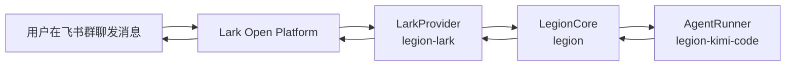

# Lark（飞书）Provider 设计

## 1. 目标

为 Legion 增加飞书（Lark）IM 适配层。用户在一个飞书 App 内把 Bot 加入多个群聊，每个群聊即为一个独立 Session；在群聊里发送 `/workdir <path>` 绑定本地项目目录后，后续普通消息会触发本地 coding agent（当前为 Kimi Code），并把 agent 的回复渲染回该群聊。

## 2. 与 Discord 的差异

| 维度 | Discord | Lark |
|---|---|---|
| 会话单元 | Channel / Thread | 群聊（chat） |
| 多会话 | Channel + Thread | 多个群聊 |
| 消息富渲染 | Embed（不可折叠） | 消息卡片（可折叠面板 `collapsible_panel`） |
| 事件接收 | Gateway（WebSocket） | 事件订阅：Webhook 或长连接（WebSocket） |
| 命令 | 原生 Slash Command + 文本 | 仅文本命令 |
| 编辑限制 | 有 rate limit | 可编辑，卡片有独立更新接口 |

核心不同点：**Lark 的消息卡片原生支持折叠块**，因此可以把 agent 的一整轮回复（思考过程、工具调用、工具结果、最终文本）放在同一张卡片里，次要信息折叠，主回复展开显示。

## 3. 整体架构



- `legion-lark` 包实现 `IMProvider` 接口。
- 它内部维护一个 `lark.Client` 用于调用 OpenAPI，以及一个事件接收机制（Webhook 或长连接）。
- `LegionCore` 不感知平台细节，只使用统一的 `IMMessage`、`IMTarget`、`AgentEvent`。

## 4. 核心映射

| Legion 抽象 | Lark 对应 |
|---|---|
| Session | 一个群聊（chat_id） |
| IMMessage.channelId | chat_id |
| IMMessage.id | message_id |
| IMMessage.authorId / authorName | sender.sender_id.open_id / sender.name |
| IMMessage.content | 解析 `message.content` JSON 后的 `text` |
| IMTarget.channelId | chat_id |
| IMTarget.replyToMessageId | 可选：触发回复的 message_id |

不实现 Thread：MVP 阶段每个群聊就是一个 Session。未来如需在群内使用话题回复，可把 `thread_id` 映射到 Lark 的 `thread_id`。

## 5. 事件接收

Lark 支持两种事件接收方式：

### 5.1 Webhook 模式（生产推荐）

- 开发者需要在 Lark 开放平台填写 **请求地址**（如 `https://your-domain.com/webhook/event`）。
- Lark 把事件以 POST 请求推送到该地址。
- 需要处理 **URL 验证（challenge）**：Lark 首次配置时会发送带 `challenge` 字段的请求，必须原样返回 `{ challenge }`。
- 需要校验请求签名（`encryptKey` 或 `verificationToken`）。

### 5.2 长连接模式（本地开发友好）

- 使用 `@larksuiteoapi/node-sdk` 的 `WSClient`，与 Lark 建立 WebSocket 长连接。
- 不需要公网地址，适合本地运行。
- 同一事件由 Lark 主动推送到客户端。

### 5.3 Provider 设计

`LarkProvider` 通过配置切换两种模式：

```ts
interface LarkProviderOptions {
  appId: string;
  appSecret: string;
  encryptKey?: string;
  verificationToken?: string;
  mode: 'webhook' | 'long-connection';
  // webhook 模式
  webhookPath?: string;
  webhookPort?: number;
  // 可选：只处理指定 chat
  allowedChatIds?: string[];
}
```

- `start()`：根据模式启动 HTTP server 或 WSClient。
- 监听事件 `im.message.receive_v1`。
- 把 Lark 消息转换为 `IMMessage` 后分发给 `onMessage` handlers。

## 6. 消息发送与渲染

### 6.1 消息类型选择

| 场景 | Lark 消息类型 | 说明 |
|---|---|---|
| 命令结果、简单提示 | `text` | 纯文本 |
| agent 完整回复 | `interactive`（卡片） | 使用 `collapsible_panel` 折叠次要信息 |
| 工具调用 | 卡片内 `collapsible_panel` | 默认折叠 |
| 工具结果 | 卡片内 `collapsible_panel` | 默认折叠 |
| 思考过程 | 卡片内 `collapsible_panel` | 默认折叠 |

### 6.2 单卡片动态更新方案

Lark 的 `collapsible_panel` 支持折叠/展开。我们采用 **一整轮回复一张卡片** 的策略：

1. 收到 prompt 时先发送一张初始卡片，标题为“思考中…”。
2. 随着 `AgentEvent` 到达，不断更新该卡片：
   - `thinking` → 放入“思考过程”折叠面板。
   - `tool_call` → 放入“工具调用”折叠面板。
   - `tool_result` → 放入“工具结果”折叠面板。
   - `text` → 更新主文本区（展开状态）。
3. `complete` 时 flush，最终卡片包含：主回复 + 折叠的思考/工具调用/工具结果。

卡片结构示例：

```json
{
  "config": { "wide_screen_mode": true },
  "header": {
    "template": "blue",
    "title": { "tag": "plain_text", "content": "Agent 回复" }
  },
  "elements": [
    { "tag": "div", "text": { "tag": "lark_md", "content": "主回复文本" } },
    {
      "tag": "collapsible_panel",
      "header": { "tag": "plain_text", "content": "💭 思考过程" },
      "expanded": false,
      "elements": [
        { "tag": "div", "text": { "tag": "plain_text", "content": "..." } }
      ]
    },
    {
      "tag": "collapsible_panel",
      "header": { "tag": "plain_text", "content": "🔧 工具调用" },
      "expanded": false,
      "elements": [
        { "tag": "div", "text": { "tag": "plain_text", "content": "..." } }
      ]
    },
    {
      "tag": "collapsible_panel",
      "header": { "tag": "plain_text", "content": "📤 工具结果" },
      "expanded": false,
      "elements": [
        { "tag": "div", "text": { "tag": "plain_text", "content": "..." } }
      ]
    }
  ]
}
```

### 6.3 卡片更新

Lark 提供两个更新途径：

1. **普通消息编辑**：`PATCH /open-apis/im/v1/messages/:message_id`，要求消息类型不变，24 小时内可编辑。
2. **卡片专用更新**：`POST /open-apis/interactive/v1/card/update`，通过卡片 `token` 更新，延迟更低、更适合高频更新。

MVP 阶段先用 **普通消息编辑** 实现动态更新，简单且覆盖完整流程。后续如果流式更新卡顿，再切换到卡片专用更新接口。

## 7. 命令处理

Lark 没有原生 Slash Command。所有命令以文本消息形式处理，与当前 `CommandParser` 完全兼容：

- `/workdir <path>`：绑定当前群聊的 workdir。
- `/workdir`：查看当前 workdir。
- `/status`：查看当前 session 状态。
- `/agent [--global|--workdir|--session] [name]`：查看或切换 runner。
- `/help`：显示帮助。

Bot 只需要识别以 `/` 开头的文本即可。

## 8. 配置

`~/.legion/config.json` 增加 `lark` 段：

```json
{
  "discord": { "botToken": "...", "allowedGuildId": "..." },
  "lark": {
    "appId": "cli_xxx",
    "appSecret": "xxx",
    "encryptKey": "optional",
    "verificationToken": "optional",
    "mode": "long-connection",
    "webhookPath": "/webhook/event",
    "webhookPort": 3000
  },
  "defaultAgent": "kimi-code"
}
```

通过环境变量也可预填：

```bash
export LEGION_LARK_APP_ID=cli_xxx
export LEGION_LARK_APP_SECRET=xxx
export LEGION_LARK_MODE=long-connection
```

## 9. 安全与权限

- Bot 必须被加入群聊才能收到该群消息。
- 建议通过 `allowedChatIds` 白名单限制可交互的群聊。
- 事件推送需要校验签名，防止伪造。
- 所有 agent 操作以运行 Legion 的 OS 用户身份执行。

## 10. 实现计划

1. 新建 `packages/legion-lark` 包：
   - `src/lark-provider.ts`：实现 `IMProvider`。
   - `src/card-builder.ts`：构建和更新交互卡片。
   - `src/event-handler.ts`：处理 Lark 事件，解析消息。
   - `src/index.ts`：导出 `LarkProvider`。
   - `tests/lark-provider.test.ts`：单元测试。
2. 更新 `packages/legion/src/config/schema.ts` 与 `loader.ts`：增加 Lark 配置。
3. 更新 `src/bootstrap.ts`：根据配置选择 Discord 或 Lark provider。
4. 更新根 `package.json` workspaces 与依赖。
5. 更新 `tsconfig.json` references。
6. 跑通 `typecheck`、`lint`、`test`、`build`。

## 11. 测试策略

- 使用 mock 的 Lark Client 和 HTTP server/WSClient，不依赖真实 Lark 环境。
- 测试事件解析：把 `im.message.receive_v1` 事件 JSON 转成 `IMMessage`。
- 测试命令文本发送：验证 `sendText` 调用 client 时参数正确。
- 测试卡片构建：验证 `renderEvent` 生成的卡片 JSON 包含预期折叠面板。
- 测试卡片更新：验证 `editText`/`editEmbed` 使用正确的 message_id。
- 测试挑战响应：webhook 模式收到 challenge 时返回原值。

---

创建日期：2026-06-15
最后更新：2026-06-15
